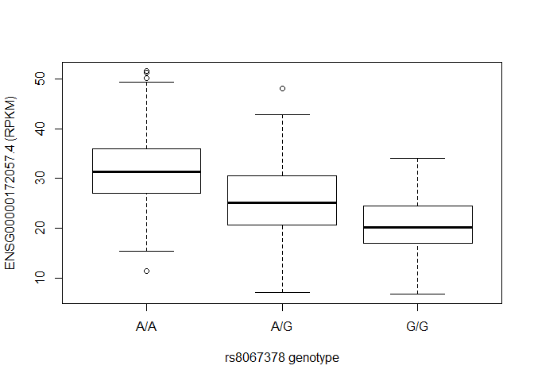

<<<<<<< HEAD
Class14: Genome Informatics 1
================

Asthma SNPs in MXL population
-----------------------------

Read file from Ensemble:

<http://uswest.ensembl.org/Homo_sapiens/Variation/Sample?db=core;r=17:39894595-39895595;v=rs8067378;vdb=variation;vf=362656008#373531_tablePanel>

``` r
mxl <- read.csv("373531-SampleGenotypes-Homo_sapiens_Variation_Sample_rs8067378.csv")

head(mxl)
```

    ##   Sample..Male.Female.Unknown. Genotype..forward.strand. Population.s.
    ## 1                  NA19648 (F)                       A|A ALL, AMR, MXL
    ## 2                  NA19649 (M)                       G|G ALL, AMR, MXL
    ## 3                  NA19651 (F)                       A|A ALL, AMR, MXL
    ## 4                  NA19652 (M)                       G|G ALL, AMR, MXL
    ## 5                  NA19654 (F)                       G|G ALL, AMR, MXL
    ## 6                  NA19655 (M)                       A|G ALL, AMR, MXL
    ##   Father Mother
    ## 1      -      -
    ## 2      -      -
    ## 3      -      -
    ## 4      -      -
    ## 5      -      -
    ## 6      -      -

``` r
table(mxl$Genotype..forward.strand.)
```

    ## 
    ## A|A A|G G|A G|G 
    ##  22  21  12   9

``` r
#sum(mxl$Genotype..forward.strand.== "G|G") would give you counts of how many G|G there are

#percent of G|G? 

table(mxl$Genotype..forward.strand.)/ nrow(mxl)
```

    ## 
    ##      A|A      A|G      G|A      G|G 
    ## 0.343750 0.328125 0.187500 0.140625

RNA-seq
-------

fastq qyality scores Q. Does the first sequence have good quality?

``` r
q <- "DDDDCDEDCDDDDBBDDDCC@"
library(seqinr)
library(gtools)

asc(s2c(q)) - 33
```

    ##  D  D  D  D  C  D  E  D  C  D  D  D  D  B  B  D  D  D  C  C  @ 
    ## 35 35 35 35 34 35 36 35 34 35 35 35 35 33 33 35 35 35 34 34 31

Population Scale analysis
-------------------------

Does the genotype for rs8067378 influence expression of the important asthma linked genes we found?

``` r
geno <- read.table("rs8067378_ENSG00000172057.6.txt")
head(geno)
```

    ##    sample geno      exp
    ## 1 HG00367  A/G 28.96038
    ## 2 NA20768  A/G 20.24449
    ## 3 HG00361  A/A 31.32628
    ## 4 HG00135  A/A 34.11169
    ## 5 NA18870  G/G 18.25141
    ## 6 NA11993  A/A 32.89721

``` r
#how many G|G?

table(geno$geno)
```

    ## 
    ## A/A A/G G/G 
    ## 108 233 121

``` r
inds <- geno$geno == "G/G"
summary(geno$exp[inds])
```

    ##    Min. 1st Qu.  Median    Mean 3rd Qu.    Max. 
    ##   6.675  16.903  20.074  20.594  24.457  33.956

``` r
inds.aa <-  geno$geno == "A/A"
summary(geno$exp[inds.aa])
```

    ##    Min. 1st Qu.  Median    Mean 3rd Qu.    Max. 
    ##   11.40   27.02   31.25   31.82   35.92   51.52

``` r
inds.ag <-  geno$geno == "A/G"
summary(geno$exp[inds.ag])
```

    ##    Min. 1st Qu.  Median    Mean 3rd Qu.    Max. 
    ##   7.075  20.626  25.065  25.397  30.552  48.034

``` r
p <- boxplot(exp~geno, data= geno, xlab="rs8067378 genotype", ylab="ENSG00000172057.4 (RPKM)")
```


=======
Class14: Genome Informatics 1
================

Asthma SNPs in MXL population
-----------------------------

Read file from Ensemble:

<http://uswest.ensembl.org/Homo_sapiens/Variation/Sample?db=core;r=17:39894595-39895595;v=rs8067378;vdb=variation;vf=362656008#373531_tablePanel>

``` r
mxl <- read.csv("373531-SampleGenotypes-Homo_sapiens_Variation_Sample_rs8067378.csv")

head(mxl)
```

    ##   Sample..Male.Female.Unknown. Genotype..forward.strand. Population.s.
    ## 1                  NA19648 (F)                       A|A ALL, AMR, MXL
    ## 2                  NA19649 (M)                       G|G ALL, AMR, MXL
    ## 3                  NA19651 (F)                       A|A ALL, AMR, MXL
    ## 4                  NA19652 (M)                       G|G ALL, AMR, MXL
    ## 5                  NA19654 (F)                       G|G ALL, AMR, MXL
    ## 6                  NA19655 (M)                       A|G ALL, AMR, MXL
    ##   Father Mother
    ## 1      -      -
    ## 2      -      -
    ## 3      -      -
    ## 4      -      -
    ## 5      -      -
    ## 6      -      -

``` r
table(mxl$Genotype..forward.strand.)
```

    ## 
    ## A|A A|G G|A G|G 
    ##  22  21  12   9

``` r
#sum(mxl$Genotype..forward.strand.== "G|G") would give you counts of how many G|G there are

#percent of G|G? 

table(mxl$Genotype..forward.strand.)/ nrow(mxl)
```

    ## 
    ##      A|A      A|G      G|A      G|G 
    ## 0.343750 0.328125 0.187500 0.140625

RNA-seq
-------

fastq qyality scores Q. Does the first sequence have good quality?

``` r
q <- "DDDDCDEDCDDDDBBDDDCC@"
library(seqinr)
library(gtools)

asc(s2c(q)) - 33
```

    ##  D  D  D  D  C  D  E  D  C  D  D  D  D  B  B  D  D  D  C  C  @ 
    ## 35 35 35 35 34 35 36 35 34 35 35 35 35 33 33 35 35 35 34 34 31

Population Scale analysis
-------------------------

Does the genotype for rs8067378 influence expression of the important asthma linked genes we found?

``` r
geno <- read.table("rs8067378_ENSG00000172057.6.txt")
head(geno)
```

    ##    sample geno      exp
    ## 1 HG00367  A/G 28.96038
    ## 2 NA20768  A/G 20.24449
    ## 3 HG00361  A/A 31.32628
    ## 4 HG00135  A/A 34.11169
    ## 5 NA18870  G/G 18.25141
    ## 6 NA11993  A/A 32.89721

``` r
#how many G|G?

table(geno$geno)
```

    ## 
    ## A/A A/G G/G 
    ## 108 233 121

``` r
inds <- geno$geno == "G/G"
summary(geno$exp[inds])
```

    ##    Min. 1st Qu.  Median    Mean 3rd Qu.    Max. 
    ##   6.675  16.903  20.074  20.594  24.457  33.956

``` r
inds.aa <-  geno$geno == "A/A"
summary(geno$exp[inds.aa])
```

    ##    Min. 1st Qu.  Median    Mean 3rd Qu.    Max. 
    ##   11.40   27.02   31.25   31.82   35.92   51.52

``` r
inds.ag <-  geno$geno == "A/G"
summary(geno$exp[inds.ag])
```

    ##    Min. 1st Qu.  Median    Mean 3rd Qu.    Max. 
    ##   7.075  20.626  25.065  25.397  30.552  48.034

``` r
p <- boxplot(exp~geno, data= geno, xlab="rs8067378 genotype", ylab="ENSG00000172057.4 (RPKM)")
```


>>>>>>> 89ef1019e68c7d6fa279e87dcff261b4c376e2c4
